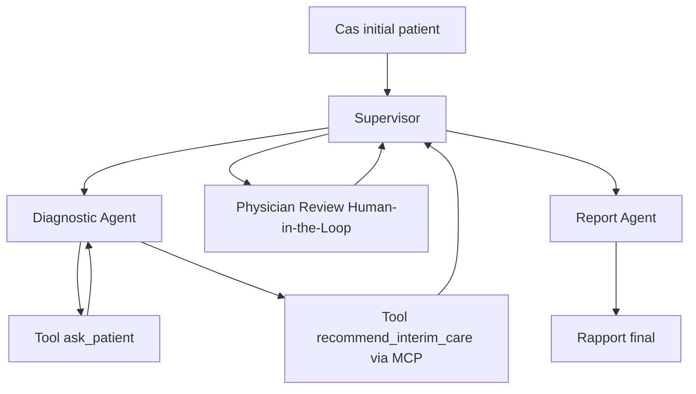

# Guide complet - Projet Medical Multi-Agent avec LangGraph, FastAPI, MCP et Frontend

## 1. Objectif du projet

Ce projet consiste a construire une application pedagogique qui simule un workflow d'orientation clinique preliminaire avec plusieurs agents IA.

L'objectif n'est pas de creer un vrai dispositif medical, mais de demontrer une architecture moderne d'IA agentique :

- un agent superviseur qui orchestre le workflow ;
- un agent diagnostic qui pose des questions au patient ;
- un outil MCP pour fournir une recommandation intermediaire prudente ;
- une etape Human-in-the-Loop ou un medecin valide ou complete la proposition ;
- un agent rapport qui genere un rapport final structure ;
- une API FastAPI ;
- une interface utilisateur ;
- des tests et une demonstration avec LangGraph Studio.

Mention obligatoire dans le projet :

```text
Ce systeme ne remplace pas une consultation medicale.
```

## 2. Ce que tu vas construire

Le workflow final attendu est le suivant :



Le resultat attendu :

1. L'utilisateur saisit un cas patient.
2. Le Diagnostic Agent pose 5 questions.
3. Le patient repond aux questions.
4. Le systeme produit une synthese clinique preliminaire.
5. Un outil MCP fournit une recommandation intermediaire prudente.
6. Le medecin intervient manuellement.
7. Le Report Agent genere un rapport final.
8. Le tout est accessible via API et frontend.
9. Le graphe est testable dans LangGraph Studio.

## 3. Stack technique recommandee

### Backend

- Python : langage principal du backend.
- LangGraph : orchestration du workflow multi-agents.
- LangChain : integration des messages, prompts et modeles LLM.
- FastAPI : creation de l'API REST.
- Pydantic : validation des donnees.
- Uvicorn : serveur de developpement pour FastAPI.

### Multi-agent et IA

- LangGraph StateGraph : permet de modeliser un workflow sous forme de graphe.
- Agents : fonctions ou noeuds specialises dans une responsabilite.
- State : dictionnaire partage qui circule entre les noeuds.
- Human-in-the-Loop : interruption volontaire du workflow pour attendre une action humaine.

### MCP

- MCP signifie Model Context Protocol.
- Il sert a exposer des outils externes utilisables par les agents.
- Dans ce projet, MCP peut exposer un outil simple comme `recommend_interim_care`.

### Frontend

Le projet sera mobile avec React Native.

- React Native : framework mobile base sur React.
- Expo : outil qui simplifie la creation, le test et le lancement de l'application mobile.
- TypeScript : typage du code frontend.
- React Navigation : navigation entre les ecrans.
- Fetch ou Axios : appels HTTP vers l'API FastAPI.
- Expo Go : application mobile pour tester rapidement sur telephone.

Ce choix est tres interessant pour le CV, car il montre une competence mobile concrete en plus de l'architecture IA backend.

### Qualite et deploiement

- Pytest : tests unitaires et tests API.
- Docker : rendre le projet facile a lancer.
- Docker Compose : lancer backend, MCP server et services techniques ensemble.
- Expo CLI : lancer l'application mobile React Native en developpement.
- README.md : documentation professionnelle.

## 4. Structure de projet recommandee

```text
medical-multi-agent-langgraph/
├── backend/
│   ├── app/
│   │   ├── api.py
│   │   ├── graph.py
│   │   ├── state.py
│   │   ├── config.py
│   │   ├── nodes/
│   │   │   ├── supervisor.py
│   │   │   ├── diagnostic_agent.py
│   │   │   ├── physician_review.py
│   │   │   └── report_agent.py
│   │   ├── tools/
│   │   │   ├── patient_tools.py
│   │   │   ├── care_tools.py
│   │   │   └── mcp_client.py
│   │   └── schemas/
│   │       └── consultation.py
│   ├── tests/
│   │   ├── test_tools.py
│   │   ├── test_graph.py
│   │   └── test_api.py
│   ├── langgraph.json
│   ├── requirements.txt
│   └── Dockerfile
├── mcp_server/
│   ├── server.py
│   ├── requirements.txt
│   └── Dockerfile
├── frontend/
│   ├── App.tsx
│   ├── package.json
│   ├── tsconfig.json
│   ├── app.json
│   └── src/
│       ├── api/
│       │   └── consultationApi.ts
│       ├── components/
│       │   └── PrimaryButton.tsx
│       ├── navigation/
│       │   └── AppNavigator.tsx
│       ├── screens/
│       │   ├── PatientCaseScreen.tsx
│       │   ├── PatientQuestionsScreen.tsx
│       │   ├── PhysicianReviewScreen.tsx
│       │   └── FinalReportScreen.tsx
│       └── types/
│           └── consultation.ts
├── docs/
│   ├── architecture.md
│   ├── api_endpoints.md
│   ├── demo_scenarios.md
│   └── screenshots/
├── docker-compose.yml
├── README.md
└── .env.example
```

## 5. Phase 1 - Initialisation du projet

### Ce qui sera construit

Tu vas creer la base du projet : dossiers, environnement Python et fichiers de dependances.

### Outils utilises

- Terminal : executer les commandes.
- Python venv : isoler les dependances du projet.
- pip : installer les bibliotheques.
- Git : suivre les changements du code.

### Commandes

```bash
mkdir medical-multi-agent-langgraph
cd medical-multi-agent-langgraph

mkdir -p backend/app/nodes backend/app/tools backend/app/schemas backend/tests
mkdir -p mcp_server docs/screenshots

python -m venv .venv
source .venv/bin/activate

git init
```

Creation du frontend mobile :

```bash
npx create-expo-app frontend --template blank-typescript
cd frontend
npm install @react-navigation/native @react-navigation/native-stack
npx expo install react-native-screens react-native-safe-area-context
cd ..
```

Fichier `backend/requirements.txt` :

```text
fastapi
uvicorn
langgraph
langchain
langchain-core
pydantic
python-dotenv
httpx
pytest
pytest-asyncio
```

Installation :

```bash
pip install -r backend/requirements.txt
```

## 6. Phase 2 - Definition de l'etat partage LangGraph

### Ce qui sera construit

Tu vas definir l'objet `MedicalState`, qui contient toutes les informations qui circulent entre les agents.

### Comment fonctionne le State

Dans LangGraph, chaque noeud recoit un etat, modifie une partie de cet etat, puis le transmet au noeud suivant.

Exemple :

- le Diagnostic Agent ajoute les questions et reponses ;
- l'outil MCP ajoute la recommandation intermediaire ;
- le medecin ajoute le traitement ;
- le Report Agent ajoute le rapport final.

### Fichier `backend/app/state.py`

```python
from typing import Annotated, Literal
from typing_extensions import TypedDict
from langgraph.graph.message import add_messages


class MedicalState(TypedDict, total=False):
    messages: Annotated[list, add_messages]
    thread_id: str
    next: Literal["diagnostic_agent", "physician_review", "report_agent", "FINISH"]
    patient_case: str
    questions: list[str]
    patient_answers: list[str]
    question_count: int
    diagnostic_summary: str
    interim_care: str
    physician_treatment: str
    final_report: str
    needs_physician_review: bool
```

## 7. Phase 3 - Creation des tools patient

### Ce qui sera construit

Tu vas creer les fonctions qui permettent de poser exactement 5 questions au patient.

### Comment fonctionnent les tools

Un tool est une fonction reutilisable par un agent. Dans ce projet, un tool peut :

- choisir la prochaine question ;
- verifier le nombre de questions ;
- formater les reponses ;
- appeler un outil externe via MCP.

### Fichier `backend/app/tools/patient_tools.py`

```python
DEFAULT_QUESTIONS = [
    "Depuis quand les symptomes ont-ils commence ?",
    "Avez-vous de la fievre ?",
    "Ressentez-vous une douleur importante ?",
    "Avez-vous des difficultes a respirer ou un malaise ?",
    "Avez-vous des antecedents medicaux importants ?",
]


def get_next_patient_question(question_count: int) -> str | None:
    if question_count >= len(DEFAULT_QUESTIONS):
        return None
    return DEFAULT_QUESTIONS[question_count]


def has_completed_patient_questions(question_count: int) -> bool:
    return question_count >= len(DEFAULT_QUESTIONS)
```

## 8. Phase 4 - Creation des agents LangGraph

### Ce qui sera construit

Tu vas creer quatre noeuds principaux :

- `supervisor`
- `diagnostic_agent`
- `physician_review`
- `report_agent`

### Comment fonctionne un noeud LangGraph

Un noeud est une fonction qui prend le `state` en entree et retourne les champs a modifier.

Exemple :

```python
def node_name(state: MedicalState) -> dict:
    return {"champ": "nouvelle valeur"}
```

### Fichier `backend/app/nodes/supervisor.py`

```python
from app.state import MedicalState


def supervisor_node(state: MedicalState) -> dict:
    if not state.get("diagnostic_summary"):
        return {"next": "diagnostic_agent"}

    if not state.get("physician_treatment"):
        return {"next": "physician_review"}

    if not state.get("final_report"):
        return {"next": "report_agent"}

    return {"next": "FINISH"}
```

### Fichier `backend/app/nodes/diagnostic_agent.py`

```python
from app.state import MedicalState
from app.tools.patient_tools import get_next_patient_question, has_completed_patient_questions


def diagnostic_agent_node(state: MedicalState) -> dict:
    question_count = state.get("question_count", 0)
    questions = state.get("questions", [])

    if not has_completed_patient_questions(question_count):
        next_question = get_next_patient_question(question_count)
        return {
            "questions": questions + [next_question],
            "question_count": question_count + 1,
        }

    answers = state.get("patient_answers", [])
    summary = (
        "Synthese clinique preliminaire basee sur le cas initial et les reponses patient. "
        f"Cas: {state.get('patient_case', '')}. "
        f"Reponses: {answers}."
    )

    return {
        "diagnostic_summary": summary,
        "interim_care": "Repos, hydratation, surveillance et consultation rapide en cas d'aggravation.",
    }
```

### Fichier `backend/app/nodes/physician_review.py`

```python
from app.state import MedicalState


def physician_review_node(state: MedicalState) -> dict:
    return {
        "needs_physician_review": True,
    }
```

Cette fonction ne remplace pas le medecin. Elle marque simplement le workflow comme en attente d'une intervention humaine.

### Fichier `backend/app/nodes/report_agent.py`

```python
from app.state import MedicalState


def report_agent_node(state: MedicalState) -> dict:
    report = f"""
# Rapport final d'orientation clinique preliminaire

## Cas initial
{state.get("patient_case", "")}

## Synthese clinique preliminaire
{state.get("diagnostic_summary", "")}

## Recommandation intermediaire
{state.get("interim_care", "")}

## Revue du medecin
{state.get("physician_treatment", "")}

## Avertissement
Ce systeme ne remplace pas une consultation medicale.
"""

    return {
        "final_report": report.strip(),
        "needs_physician_review": False,
    }
```

## 9. Phase 5 - Construction du graphe LangGraph

### Ce qui sera construit

Tu vas assembler les agents dans un workflow executable.

### Comment fonctionne LangGraph

LangGraph permet de creer un graphe :

- les noeuds representent des fonctions ;
- les transitions representent le chemin entre les fonctions ;
- le state transporte les donnees ;
- le supervisor decide la prochaine etape.

### Fichier `backend/app/graph.py`

```python
from langgraph.graph import StateGraph, START, END

from app.state import MedicalState
from app.nodes.supervisor import supervisor_node
from app.nodes.diagnostic_agent import diagnostic_agent_node
from app.nodes.physician_review import physician_review_node
from app.nodes.report_agent import report_agent_node


def route_from_supervisor(state: MedicalState) -> str:
    next_step = state.get("next")
    if next_step == "diagnostic_agent":
        return "diagnostic_agent"
    if next_step == "physician_review":
        return "physician_review"
    if next_step == "report_agent":
        return "report_agent"
    return END


def build_graph():
    builder = StateGraph(MedicalState)

    builder.add_node("supervisor", supervisor_node)
    builder.add_node("diagnostic_agent", diagnostic_agent_node)
    builder.add_node("physician_review", physician_review_node)
    builder.add_node("report_agent", report_agent_node)

    builder.add_edge(START, "supervisor")
    builder.add_conditional_edges("supervisor", route_from_supervisor)
    builder.add_edge("diagnostic_agent", "supervisor")
    builder.add_edge("physician_review", "supervisor")
    builder.add_edge("report_agent", "supervisor")

    return builder.compile()


graph = build_graph()
```

## 10. Phase 6 - Ajout de MCP

### Ce qui sera construit

Tu vas creer un petit serveur MCP qui expose un outil de recommandation intermediaire.

### Comment fonctionne MCP

MCP permet a une application IA d'utiliser des outils externes de maniere standardisee.

Dans ce projet :

- le serveur MCP expose `recommend_interim_care` ;
- le backend appelle cet outil ;
- le resultat est ajoute dans le state LangGraph.

### Exemple logique de l'outil MCP

Fichier `mcp_server/server.py` :

```python
def recommend_interim_care(symptoms: str) -> str:
    symptoms_lower = symptoms.lower()

    if "difficulte a respirer" in symptoms_lower or "douleur thoracique" in symptoms_lower:
        return (
            "Presence possible de red flags. Recommandation prudente: "
            "consulter rapidement un professionnel de sante ou un service d'urgence."
        )

    if "fievre" in symptoms_lower or "toux" in symptoms_lower:
        return (
            "Mesures generales: repos, hydratation, surveillance de la temperature "
            "et consultation si aggravation."
        )

    return (
        "Mesures generales: surveillance, repos si necessaire, hydratation "
        "et avis medical si les symptomes persistent."
    )
```

Pour une vraie integration MCP, utilise le SDK MCP officiel ou un serveur compatible avec ton environnement. Le plus important pour le projet est de montrer :

- ou l'outil est expose ;
- comment il est appele ;
- comment sa reponse influence le workflow.

## 11. Phase 7 - API FastAPI

### Ce qui sera construit

Tu vas exposer le graphe via une API REST.

### Comment fonctionne FastAPI

FastAPI permet de creer rapidement des endpoints HTTP :

- `POST` pour envoyer des donnees ;
- `GET` pour recuperer des donnees ;
- Pydantic pour valider les entrees ;
- Uvicorn pour lancer le serveur.

### Endpoints obligatoires

```text
POST /sessions/start
POST /consultation/start
POST /consultation/resume
GET /consultation/{thread_id}
GET /consultation/{thread_id}/report
```

### Fichier `backend/app/schemas/consultation.py`

```python
from pydantic import BaseModel


class StartConsultationRequest(BaseModel):
    patient_case: str


class ResumeConsultationRequest(BaseModel):
    thread_id: str
    patient_answer: str | None = None
    physician_treatment: str | None = None
```

### Fichier `backend/app/api.py`

```python
from uuid import uuid4

from fastapi import FastAPI, HTTPException

from app.graph import graph
from app.schemas.consultation import StartConsultationRequest, ResumeConsultationRequest

app = FastAPI(title="Medical Multi-Agent Workflow")

SESSIONS: dict[str, dict] = {}


@app.post("/sessions/start")
def start_session():
    thread_id = str(uuid4())
    SESSIONS[thread_id] = {"thread_id": thread_id}
    return {"thread_id": thread_id}


@app.post("/consultation/start")
def start_consultation(payload: StartConsultationRequest):
    thread_id = str(uuid4())
    initial_state = {
        "thread_id": thread_id,
        "patient_case": payload.patient_case,
        "questions": [],
        "patient_answers": [],
        "question_count": 0,
    }

    result = graph.invoke(initial_state)
    SESSIONS[thread_id] = result
    return result


@app.post("/consultation/resume")
def resume_consultation(payload: ResumeConsultationRequest):
    state = SESSIONS.get(payload.thread_id)
    if not state:
        raise HTTPException(status_code=404, detail="Consultation introuvable")

    if payload.patient_answer:
        answers = state.get("patient_answers", [])
        state["patient_answers"] = answers + [payload.patient_answer]

    if payload.physician_treatment:
        state["physician_treatment"] = payload.physician_treatment
        state["needs_physician_review"] = False

    result = graph.invoke(state)
    SESSIONS[payload.thread_id] = result
    return result


@app.get("/consultation/{thread_id}")
def get_consultation(thread_id: str):
    state = SESSIONS.get(thread_id)
    if not state:
        raise HTTPException(status_code=404, detail="Consultation introuvable")
    return state


@app.get("/consultation/{thread_id}/report")
def get_report(thread_id: str):
    state = SESSIONS.get(thread_id)
    if not state:
        raise HTTPException(status_code=404, detail="Consultation introuvable")
    return {"final_report": state.get("final_report")}
```

Lancement :

```bash
cd backend
uvicorn app.api:app --reload
```

Documentation API :

```text
http://localhost:8000/docs
```

## 12. Phase 8 - Application mobile React Native

### Ce qui sera construit

Tu vas creer une application mobile avec React Native et Expo.

L'application contiendra 4 ecrans :

1. `PatientCaseScreen` : saisie du cas initial patient.
2. `PatientQuestionsScreen` : affichage des 5 questions et envoi des reponses.
3. `PhysicianReviewScreen` : saisie de la revue medecin.
4. `FinalReportScreen` : affichage du rapport final.

### Comment fonctionne React Native

React Native permet de creer une application mobile avec JavaScript ou TypeScript.

Concepts importants :

- `View` : conteneur visuel.
- `Text` : affichage de texte.
- `TextInput` : champ de saisie.
- `Pressable` ou `TouchableOpacity` : bouton.
- `useState` : stocker l'etat local d'un ecran.
- `fetch` : appeler l'API FastAPI.
- React Navigation : passer d'un ecran a un autre.

### Comment fonctionne Expo

Expo simplifie le developpement React Native :

- pas besoin de configurer Android Studio au debut ;
- test rapide avec l'application Expo Go ;
- lancement avec `npx expo start` ;
- QR code pour ouvrir l'app sur telephone.

### Creation du projet mobile

```bash
npx create-expo-app frontend --template blank-typescript
cd frontend
npm install @react-navigation/native @react-navigation/native-stack
npx expo install react-native-screens react-native-safe-area-context
```

### Fichier `frontend/src/types/consultation.ts`

```typescript
export type ConsultationState = {
  thread_id: string;
  patient_case?: string;
  questions?: string[];
  patient_answers?: string[];
  question_count?: number;
  diagnostic_summary?: string;
  interim_care?: string;
  physician_treatment?: string;
  final_report?: string;
  needs_physician_review?: boolean;
};
```

### Fichier `frontend/src/api/consultationApi.ts`

```typescript
import { ConsultationState } from "../types/consultation";

// Sur simulateur iOS, localhost fonctionne souvent.
// Sur Android Emulator, utilise http://10.0.2.2:8000.
// Sur telephone physique, utilise l'adresse IP locale de ton ordinateur.
const API_URL = "http://localhost:8000";

export async function startConsultation(patientCase: string): Promise<ConsultationState> {
  const response = await fetch(`${API_URL}/consultation/start`, {
    method: "POST",
    headers: {
      "Content-Type": "application/json",
    },
    body: JSON.stringify({
      patient_case: patientCase,
    }),
  });

  if (!response.ok) {
    throw new Error("Impossible de demarrer la consultation");
  }

  return response.json();
}

export async function resumeConsultation(params: {
  threadId: string;
  patientAnswer?: string;
  physicianTreatment?: string;
}): Promise<ConsultationState> {
  const response = await fetch(`${API_URL}/consultation/resume`, {
    method: "POST",
    headers: {
      "Content-Type": "application/json",
    },
    body: JSON.stringify({
      thread_id: params.threadId,
      patient_answer: params.patientAnswer,
      physician_treatment: params.physicianTreatment,
    }),
  });

  if (!response.ok) {
    throw new Error("Impossible de reprendre la consultation");
  }

  return response.json();
}
```

### Fichier `frontend/src/navigation/AppNavigator.tsx`

```typescript
import { createNativeStackNavigator } from "@react-navigation/native-stack";
import { NavigationContainer } from "@react-navigation/native";

import { ConsultationState } from "../types/consultation";
import { PatientCaseScreen } from "../screens/PatientCaseScreen";
import { PatientQuestionsScreen } from "../screens/PatientQuestionsScreen";
import { PhysicianReviewScreen } from "../screens/PhysicianReviewScreen";
import { FinalReportScreen } from "../screens/FinalReportScreen";

export type RootStackParamList = {
  PatientCase: undefined;
  PatientQuestions: { consultation: ConsultationState };
  PhysicianReview: { consultation: ConsultationState };
  FinalReport: { consultation: ConsultationState };
};

const Stack = createNativeStackNavigator<RootStackParamList>();

export function AppNavigator() {
  return (
    <NavigationContainer>
      <Stack.Navigator>
        <Stack.Screen
          name="PatientCase"
          component={PatientCaseScreen}
          options={{ title: "Cas patient" }}
        />
        <Stack.Screen
          name="PatientQuestions"
          component={PatientQuestionsScreen}
          options={{ title: "Questions" }}
        />
        <Stack.Screen
          name="PhysicianReview"
          component={PhysicianReviewScreen}
          options={{ title: "Revue medecin" }}
        />
        <Stack.Screen
          name="FinalReport"
          component={FinalReportScreen}
          options={{ title: "Rapport final" }}
        />
      </Stack.Navigator>
    </NavigationContainer>
  );
}
```

### Fichier `frontend/App.tsx`

```typescript
import { AppNavigator } from "./src/navigation/AppNavigator";

export default function App() {
  return <AppNavigator />;
}
```

### Fichier `frontend/src/screens/PatientCaseScreen.tsx`

```typescript
import { useState } from "react";
import { Alert, Pressable, StyleSheet, Text, TextInput, View } from "react-native";
import { NativeStackScreenProps } from "@react-navigation/native-stack";

import { startConsultation } from "../api/consultationApi";
import { RootStackParamList } from "../navigation/AppNavigator";

type Props = NativeStackScreenProps<RootStackParamList, "PatientCase">;

export function PatientCaseScreen({ navigation }: Props) {
  const [patientCase, setPatientCase] = useState("");
  const [loading, setLoading] = useState(false);

  async function handleStart() {
    if (!patientCase.trim()) {
      Alert.alert("Champ obligatoire", "Veuillez saisir le cas initial patient.");
      return;
    }

    try {
      setLoading(true);
      const consultation = await startConsultation(patientCase);
      navigation.navigate("PatientQuestions", { consultation });
    } catch (error) {
      Alert.alert("Erreur", "Verifier que l'API FastAPI est lancee.");
    } finally {
      setLoading(false);
    }
  }

  return (
    <View style={styles.container}>
      <Text style={styles.title}>Orientation clinique preliminaire</Text>
      <TextInput
        style={styles.input}
        multiline
        placeholder="Exemple: Patient de 28 ans avec toux et fievre depuis 2 jours."
        value={patientCase}
        onChangeText={setPatientCase}
      />
      <Pressable style={styles.button} onPress={handleStart} disabled={loading}>
        <Text style={styles.buttonText}>{loading ? "Chargement..." : "Demarrer"}</Text>
      </Pressable>
      <Text style={styles.disclaimer}>Ce systeme ne remplace pas une consultation medicale.</Text>
    </View>
  );
}

const styles = StyleSheet.create({
  container: {
    flex: 1,
    padding: 24,
    justifyContent: "center",
    backgroundColor: "#f8fafc",
  },
  title: {
    fontSize: 24,
    fontWeight: "700",
    marginBottom: 16,
    color: "#0f172a",
  },
  input: {
    minHeight: 160,
    borderWidth: 1,
    borderColor: "#cbd5e1",
    backgroundColor: "#ffffff",
    padding: 14,
    borderRadius: 8,
    textAlignVertical: "top",
  },
  button: {
    marginTop: 16,
    backgroundColor: "#2563eb",
    padding: 14,
    borderRadius: 8,
    alignItems: "center",
  },
  buttonText: {
    color: "#ffffff",
    fontWeight: "700",
  },
  disclaimer: {
    marginTop: 16,
    color: "#64748b",
    fontSize: 13,
  },
});
```

### Fichier `frontend/src/screens/PatientQuestionsScreen.tsx`

```typescript
import { useState } from "react";
import { Alert, Pressable, StyleSheet, Text, TextInput, View } from "react-native";
import { NativeStackScreenProps } from "@react-navigation/native-stack";

import { resumeConsultation } from "../api/consultationApi";
import { RootStackParamList } from "../navigation/AppNavigator";

type Props = NativeStackScreenProps<RootStackParamList, "PatientQuestions">;

export function PatientQuestionsScreen({ route, navigation }: Props) {
  const [consultation, setConsultation] = useState(route.params.consultation);
  const [answer, setAnswer] = useState("");
  const [loading, setLoading] = useState(false);

  const questions = consultation.questions ?? [];
  const answers = consultation.patient_answers ?? [];
  const currentQuestion = questions[answers.length];

  async function handleAnswer() {
    if (!answer.trim()) {
      Alert.alert("Champ obligatoire", "Veuillez repondre a la question.");
      return;
    }

    try {
      setLoading(true);
      const updated = await resumeConsultation({
        threadId: consultation.thread_id,
        patientAnswer: answer,
      });

      setAnswer("");

      if (updated.needs_physician_review) {
        navigation.navigate("PhysicianReview", { consultation: updated });
        return;
      }

      setConsultation(updated);
    } catch (error) {
      Alert.alert("Erreur", "Impossible d'envoyer la reponse.");
    } finally {
      setLoading(false);
    }
  }

  if (!currentQuestion && consultation.needs_physician_review) {
    navigation.navigate("PhysicianReview", { consultation });
  }

  return (
    <View style={styles.container}>
      <Text style={styles.progress}>Question {answers.length + 1} / 5</Text>
      <Text style={styles.question}>{currentQuestion}</Text>
      <TextInput
        style={styles.input}
        placeholder="Votre reponse"
        value={answer}
        onChangeText={setAnswer}
      />
      <Pressable style={styles.button} onPress={handleAnswer} disabled={loading}>
        <Text style={styles.buttonText}>{loading ? "Envoi..." : "Envoyer"}</Text>
      </Pressable>
    </View>
  );
}

const styles = StyleSheet.create({
  container: {
    flex: 1,
    padding: 24,
    justifyContent: "center",
    backgroundColor: "#f8fafc",
  },
  progress: {
    color: "#475569",
    marginBottom: 12,
  },
  question: {
    fontSize: 22,
    fontWeight: "700",
    color: "#0f172a",
    marginBottom: 16,
  },
  input: {
    borderWidth: 1,
    borderColor: "#cbd5e1",
    backgroundColor: "#ffffff",
    padding: 14,
    borderRadius: 8,
  },
  button: {
    marginTop: 16,
    backgroundColor: "#2563eb",
    padding: 14,
    borderRadius: 8,
    alignItems: "center",
  },
  buttonText: {
    color: "#ffffff",
    fontWeight: "700",
  },
});
```

### Fichier `frontend/src/screens/PhysicianReviewScreen.tsx`

```typescript
import { useState } from "react";
import { Alert, Pressable, StyleSheet, Text, TextInput, View } from "react-native";
import { NativeStackScreenProps } from "@react-navigation/native-stack";

import { resumeConsultation } from "../api/consultationApi";
import { RootStackParamList } from "../navigation/AppNavigator";

type Props = NativeStackScreenProps<RootStackParamList, "PhysicianReview">;

export function PhysicianReviewScreen({ route, navigation }: Props) {
  const consultation = route.params.consultation;
  const [treatment, setTreatment] = useState("");
  const [loading, setLoading] = useState(false);

  async function handleValidate() {
    if (!treatment.trim()) {
      Alert.alert("Champ obligatoire", "Veuillez saisir la conduite a tenir.");
      return;
    }

    try {
      setLoading(true);
      const updated = await resumeConsultation({
        threadId: consultation.thread_id,
        physicianTreatment: treatment,
      });
      navigation.navigate("FinalReport", { consultation: updated });
    } catch (error) {
      Alert.alert("Erreur", "Impossible de valider la revue medecin.");
    } finally {
      setLoading(false);
    }
  }

  return (
    <View style={styles.container}>
      <Text style={styles.title}>Revue medecin</Text>
      <Text style={styles.label}>Synthese preliminaire</Text>
      <Text style={styles.summary}>{consultation.diagnostic_summary}</Text>
      <Text style={styles.label}>Recommandation intermediaire</Text>
      <Text style={styles.summary}>{consultation.interim_care}</Text>
      <TextInput
        style={styles.input}
        multiline
        placeholder="Traitement ou conduite a tenir"
        value={treatment}
        onChangeText={setTreatment}
      />
      <Pressable style={styles.button} onPress={handleValidate} disabled={loading}>
        <Text style={styles.buttonText}>{loading ? "Validation..." : "Valider"}</Text>
      </Pressable>
    </View>
  );
}

const styles = StyleSheet.create({
  container: {
    flex: 1,
    padding: 24,
    backgroundColor: "#f8fafc",
  },
  title: {
    fontSize: 24,
    fontWeight: "700",
    color: "#0f172a",
    marginBottom: 16,
  },
  label: {
    fontWeight: "700",
    color: "#334155",
    marginTop: 12,
  },
  summary: {
    color: "#475569",
    marginTop: 6,
  },
  input: {
    marginTop: 16,
    minHeight: 140,
    borderWidth: 1,
    borderColor: "#cbd5e1",
    backgroundColor: "#ffffff",
    padding: 14,
    borderRadius: 8,
    textAlignVertical: "top",
  },
  button: {
    marginTop: 16,
    backgroundColor: "#2563eb",
    padding: 14,
    borderRadius: 8,
    alignItems: "center",
  },
  buttonText: {
    color: "#ffffff",
    fontWeight: "700",
  },
});
```

### Fichier `frontend/src/screens/FinalReportScreen.tsx`

```typescript
import { ScrollView, StyleSheet, Text } from "react-native";
import { NativeStackScreenProps } from "@react-navigation/native-stack";

import { RootStackParamList } from "../navigation/AppNavigator";

type Props = NativeStackScreenProps<RootStackParamList, "FinalReport">;

export function FinalReportScreen({ route }: Props) {
  const { consultation } = route.params;

  return (
    <ScrollView contentContainerStyle={styles.container}>
      <Text style={styles.title}>Rapport final</Text>
      <Text style={styles.report}>{consultation.final_report}</Text>
    </ScrollView>
  );
}

const styles = StyleSheet.create({
  container: {
    padding: 24,
    backgroundColor: "#f8fafc",
  },
  title: {
    fontSize: 24,
    fontWeight: "700",
    color: "#0f172a",
    marginBottom: 16,
  },
  report: {
    color: "#334155",
    lineHeight: 22,
  },
});
```

### Lancement du backend

```bash
cd backend
uvicorn app.api:app --reload --host 0.0.0.0 --port 8000
```

### Lancement de l'application mobile

```bash
cd frontend
npx expo start
```

Ensuite :

- appuie sur `i` pour lancer le simulateur iOS ;
- appuie sur `a` pour lancer l'emulateur Android ;
- scanne le QR code avec Expo Go pour tester sur telephone.

### Important pour l'adresse API

Si l'application mobile ne se connecte pas au backend :

- iOS Simulator : essaie `http://localhost:8000`.
- Android Emulator : utilise `http://10.0.2.2:8000`.
- Telephone physique : utilise l'adresse IP locale de ton ordinateur, par exemple `http://192.168.1.20:8000`.

Pour trouver ton IP locale sur macOS :

```bash
ipconfig getifaddr en0
```

## 13. Phase 9 - Tests obligatoires

### Ce qui sera construit

Tu vas tester les composants importants du projet.

### Comment fonctionne Pytest

Pytest cherche les fichiers qui commencent par `test_` et execute les fonctions qui commencent par `test_`.

### Scenarios a tester

1. Syndrome respiratoire simple.
2. Cas avec red flags.
3. Cas benin.

Pour chaque scenario, verifier :

- 5 questions posees ;
- reponses patient stockees ;
- synthese clinique generee ;
- recommandation intermediaire generee ;
- revue medecin obligatoire ;
- rapport final genere ;
- mention ethique presente.

### Exemple `backend/tests/test_tools.py`

```python
from app.tools.patient_tools import get_next_patient_question, has_completed_patient_questions


def test_get_next_patient_question():
    assert get_next_patient_question(0) is not None
    assert get_next_patient_question(4) is not None
    assert get_next_patient_question(5) is None


def test_has_completed_patient_questions():
    assert has_completed_patient_questions(0) is False
    assert has_completed_patient_questions(5) is True
```

### Exemple `backend/tests/test_graph.py`

```python
from app.graph import graph


def test_graph_generates_questions():
    result = graph.invoke({
        "patient_case": "Patient avec toux et fievre",
        "questions": [],
        "patient_answers": [],
        "question_count": 0,
    })

    assert result["question_count"] >= 1
    assert len(result["questions"]) >= 1
```

Lancement :

```bash
cd backend
pytest
```

## 14. Phase 10 - LangGraph Studio

### Ce qui sera construit

Tu vas rendre le graphe visible et testable dans LangGraph Studio.

### Comment fonctionne LangGraph Studio

LangGraph Studio permet de visualiser :

- les noeuds du graphe ;
- les transitions ;
- l'etat intermediaire ;
- les interruptions ;
- les erreurs.

### Fichier `backend/langgraph.json`

```json
{
  "dependencies": ["."],
  "graphs": {
    "medical_workflow": "./app/graph.py:graph"
  },
  "env": ".env"
}
```

Commande typique :

```bash
cd backend
langgraph dev
```

Pendant la demonstration, montre :

1. Le passage `Supervisor -> Diagnostic Agent`.
2. La boucle des 5 questions.
3. La synthese clinique preliminaire.
4. L'attente de la revue medecin.
5. Le passage vers `Report Agent`.
6. Le rapport final.

## 15. Phase 11 - Docker et Docker Compose pour les services backend

### Ce qui sera construit

Tu vas rendre les services backend lancables avec une seule commande.

L'application mobile React Native sera lancee separement avec Expo, car pendant le developpement mobile on teste generalement sur simulateur, emulateur ou telephone physique.

### Comment fonctionne Docker

Docker emballe une application avec ses dependances dans une image.

### Comment fonctionne Docker Compose

Docker Compose lance plusieurs services ensemble :

- backend FastAPI ;
- serveur MCP ;
- base de donnees si tu ajoutes PostgreSQL ou SQLite dans un volume.

### Exemple `docker-compose.yml`

```yaml
services:
  backend:
    build: ./backend
    ports:
      - "8000:8000"
    env_file:
      - .env

  mcp_server:
    build: ./mcp_server
    ports:
      - "9000:9000"
```

Commande :

```bash
docker compose up --build
```

Pour tester l'application mobile :

```bash
cd frontend
npx expo start
```

En production, l'application React Native peut etre compilee avec EAS Build pour generer une application Android ou iOS.

## 16. Phase 12 - Export PDF du rapport

### Ce qui sera construit

Tu peux ajouter une fonctionnalite bonus qui transforme le rapport final en PDF.

### Pourquoi c'est important

Un export PDF rend le projet plus concret et plus impressionnant :

- sortie professionnelle ;
- livrable telechargeable ;
- meilleur rendu pour une demo.

### Outils possibles

- ReportLab : generation PDF en Python.
- WeasyPrint : HTML vers PDF.
- Markdown + PDF : conversion du rapport Markdown.

Fonctionnalite recommandee :

```text
GET /consultation/{thread_id}/report/pdf
```

## 17. Phase 13 - Persistance des consultations

### Ce qui sera construit

Tu peux remplacer le dictionnaire `SESSIONS` par une base de donnees.

### Pourquoi c'est important

Sans base de donnees, les consultations disparaissent quand le serveur redemarre.

Options :

- SQLite : simple et suffisant pour un mini-projet.
- PostgreSQL : plus professionnel.

Table possible :

```text
consultations
- id
- thread_id
- patient_case
- patient_answers
- diagnostic_summary
- interim_care
- physician_treatment
- final_report
- created_at
- updated_at
```

## 18. Phase 14 - README professionnel

### Ce qui sera construit

Le README doit vendre le projet techniquement.

### Structure conseillee

```text
# Medical Multi-Agent Workflow

## Overview
## Features
## Architecture
## Tech Stack
## Workflow
## API Endpoints
## Installation
## Running with Docker
## Demo Scenarios
## Tests
## Ethical Disclaimer
## Screenshots
## Future Improvements
```

### Description courte pour GitHub

```text
Multi-agent clinical orientation workflow using LangGraph, FastAPI, MCP and Human-in-the-Loop review.
```

### Badges a afficher

```text
LangGraph | LangChain | FastAPI | MCP | Human-in-the-Loop | React Native | Expo | Docker | Pytest
```

## 19. Phase 15 - Scenarios de demonstration

### Scenario 1 - Syndrome respiratoire simple

Cas initial :

```text
Patient de 28 ans avec toux, fievre moderee et fatigue depuis 2 jours.
```

Attendu :

- 5 questions ;
- recommandation prudente ;
- surveillance ;
- consultation si aggravation.

### Scenario 2 - Red flags

Cas initial :

```text
Patient de 60 ans avec douleur thoracique, essoufflement et malaise.
```

Attendu :

- detection prudente de signaux d'alerte ;
- recommandation de consultation urgente ;
- validation medecin obligatoire.

### Scenario 3 - Cas benin

Cas initial :

```text
Patient de 22 ans avec leger mal de gorge sans fievre ni gene respiratoire.
```

Attendu :

- mesures generales ;
- surveillance ;
- rapport final clair.

## 20. Comment le mettre en valeur sur le CV

### Version courte

```text
Medical Multi-Agent Mobile Workflow - LangGraph, FastAPI, MCP, React Native
Developpement d'une application mobile React Native connectee a un workflow IA multi-agents simulant une orientation clinique preliminaire, avec orchestration LangGraph, Human-in-the-Loop medecin, API FastAPI, outil MCP et tests de scenarios.
```

### Version detaillee

```text
Medical Multi-Agent Mobile Workflow - LangGraph / LangChain / FastAPI / MCP / React Native
- Conception d'un systeme multi-agents avec Supervisor, Diagnostic Agent, Physician Review et Report Agent.
- Gestion d'un etat partage LangGraph et d'un workflow Human-in-the-Loop.
- Exposition du graphe via une API REST FastAPI.
- Integration d'un outil externe via MCP pour les recommandations intermediaires.
- Developpement d'une application mobile React Native avec navigation entre saisie patient, questions, revue medecin et rapport final.
- Tests de scenarios cliniques simules et demonstration dans LangGraph Studio.
```

## 21. Checklist finale

### Fonctionnel

- [ ] Le patient peut saisir un cas initial.
- [ ] Le Diagnostic Agent pose exactement 5 questions.
- [ ] Les reponses sont stockees dans le state.
- [ ] La synthese clinique preliminaire est generee.
- [ ] L'outil MCP genere une recommandation intermediaire.
- [ ] Le medecin peut saisir un traitement ou une conduite a tenir.
- [ ] Le rapport final est genere.
- [ ] Le rapport contient l'avertissement ethique.

### Technique

- [ ] Le backend FastAPI fonctionne.
- [ ] Les endpoints obligatoires existent.
- [ ] L'application mobile React Native fonctionne avec Expo.
- [ ] L'application mobile communique correctement avec l'API FastAPI.
- [ ] Le graphe est testable dans LangGraph Studio.
- [ ] Les tests Pytest passent.
- [ ] Docker Compose lance les services backend.
- [ ] Le README explique le projet clairement.

### Portfolio

- [ ] Le repo GitHub est propre.
- [ ] Le README contient un schema d'architecture.
- [ ] Des captures d'ecran sont ajoutees.
- [ ] Une video de demonstration courte est disponible.
- [ ] La description GitHub est claire.
- [ ] Le projet est ajoute au CV.

## 22. Ordre de realisation recommande

1. Creer la structure du projet.
2. Definir `MedicalState`.
3. Creer les tools patient.
4. Creer les noeuds LangGraph.
5. Construire le graphe.
6. Tester le graphe en local.
7. Ajouter l'API FastAPI.
8. Ajouter l'application mobile React Native avec Expo.
9. Ajouter MCP.
10. Tester dans LangGraph Studio.
11. Ajouter Pytest.
12. Ajouter Docker Compose.
13. Ajouter export PDF si possible.
14. Rediger le README.
15. Faire captures d'ecran et demo video.
16. Ajouter le projet au CV.

## 23. Conseils importants

- Ne presente jamais le projet comme un outil de diagnostic medical reel.
- Utilise toujours les termes "orientation clinique preliminaire" ou "synthese clinique preliminaire".
- Garde le code simple et lisible.
- Documente les limites du systeme.
- Montre clairement le Human-in-the-Loop, car c'est l'un des points les plus importants.
- Montre LangGraph Studio dans la demo, car cela prouve que le workflow est reellement orchestre.
- Ajoute Docker si tu veux que le projet paraisse plus professionnel.
- Ajoute des tests pour montrer que le projet n'est pas juste une demo fragile.

## 24. Niveau attendu pour un bon rendu

Un rendu acceptable contient :

- LangGraph ;
- FastAPI ;
- une application mobile React Native ;
- une revue medecin ;
- un outil MCP ;
- un README clair.

Un tres bon rendu contient en plus :

- Docker Compose ;
- tests Pytest ;
- export PDF ;
- historique des consultations ;
- captures d'ecran ;
- demo video ;
- documentation API.

Un rendu excellent contient :

- interface propre ;
- architecture modulaire ;
- vraie persistance PostgreSQL ou SQLite ;
- erreurs gerees proprement ;
- schemas Pydantic ;
- logs ;
- tests API ;
- rapport technique court ;
- demonstration LangGraph Studio.
