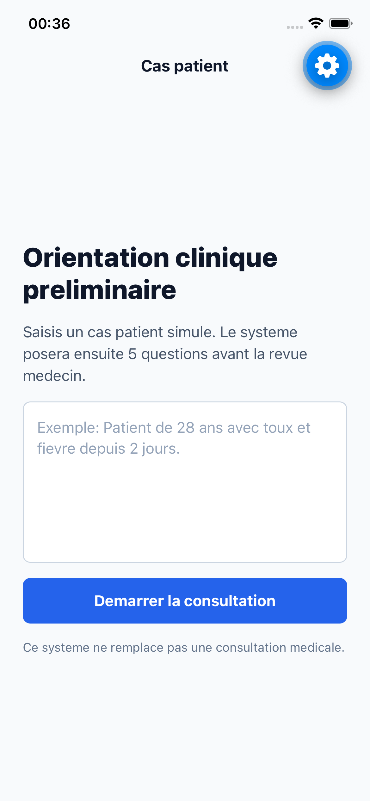
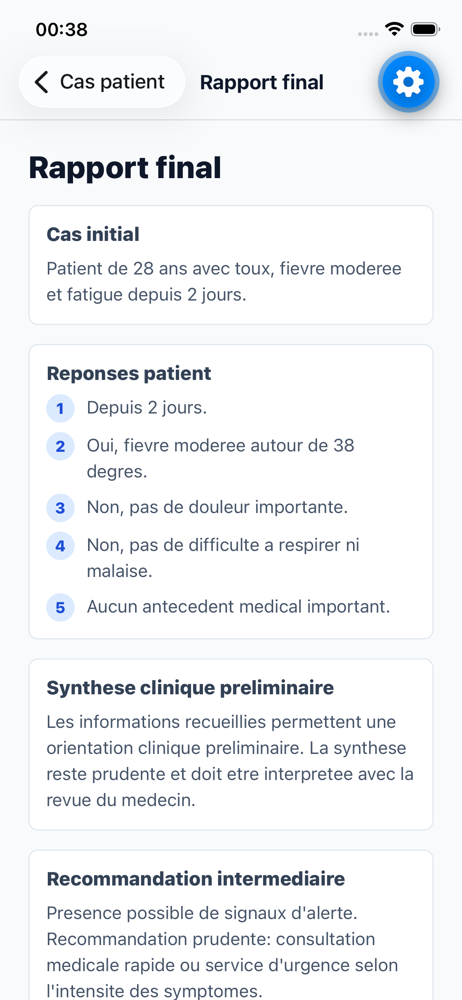
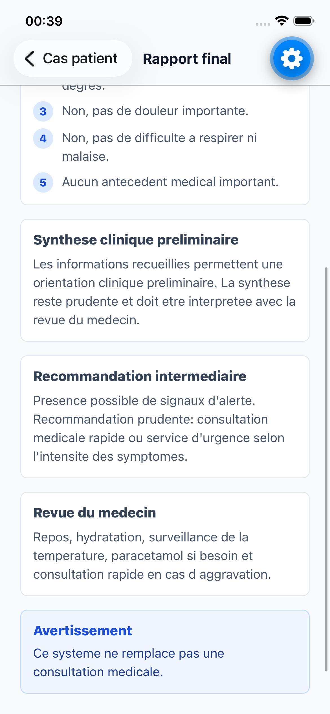

# Medical Multi-Agent Mobile Workflow

Application pedagogique d'orientation clinique preliminaire construite avec LangGraph, LangChain, FastAPI, MCP, Ollama et React Native.

> Ce systeme ne remplace pas une consultation medicale.

## Objectif

Ce projet simule un workflow multi-agents medical :

1. un utilisateur saisit un cas patient dans une application mobile ;
2. un Diagnostic Agent pose 5 questions ;
3. un LLM genere une synthese clinique preliminaire ;
4. un tool MCP produit une recommandation intermediaire prudente ;
5. un medecin intervient manuellement ;
6. un Report Agent genere le rapport final ;
7. le rapport est affiche dans l'application mobile.

Le projet est academique. Il ne fournit pas de diagnostic definitif.

## Stack

- Backend : Python, FastAPI, LangGraph, LangChain
- LLM local : Ollama avec `llama3.2`
- Tools : MCP-like JSON-RPC server
- Mobile : React Native, Expo, TypeScript
- Tests : Pytest, FastAPI TestClient
- Visualisation : LangGraph Studio

## Architecture

```text
React Native / Expo
        |
        v
FastAPI backend
        |
        v
LangGraph workflow
        |
        +--> Supervisor
        +--> Diagnostic Agent
        |       +--> LangChain prompt -> Ollama
        |       +--> MCP tool -> recommend_interim_care
        +--> Physician Review Human-in-the-Loop
        +--> Report Agent
                +--> LangChain prompt -> Ollama
```

## Structure

```text
.
├── backend/
│   ├── app/
│   │   ├── api.py
│   │   ├── graph.py
│   │   ├── llm.py
│   │   ├── state.py
│   │   ├── nodes/
│   │   ├── schemas/
│   │   └── tools/
│   ├── tests/
│   ├── langgraph.json
│   └── requirements.txt
├── frontend/
│   ├── App.tsx
│   └── src/
│       ├── api/
│       ├── components/
│       ├── navigation/
│       ├── screens/
│       └── types/
├── mcp_server/
│   └── server.py
├── docs/
│   ├── langgraph_studio_demo.md
│   └── rapport_technique.md
└── GUIDE_REALISATION_PROJET.md
```

## Installation

Depuis la racine du projet :

```bash
python3 -m venv .venv
source .venv/bin/activate
pip install -r backend/requirements.txt
```

Installer les dependances mobile :

```bash
cd frontend
npm install
```

## Configuration

Copier l'exemple d'environnement :

```bash
cp backend/.env.example backend/.env
```

Configuration recommandee :

```text
LLM_PROVIDER=ollama
OLLAMA_BASE_URL=http://localhost:11434
OLLAMA_MODEL=llama3.2
MCP_SERVER_URL=http://localhost:9000/mcp
```

Verifier Ollama :

```bash
ollama list
```

Si `llama3.2` n'est pas installe :

```bash
ollama pull llama3.2
```

## Lancement

Terminal 1 - serveur MCP :

```bash
cd mcp_server
../.venv/bin/python -m uvicorn server:app --host 127.0.0.1 --port 9000
```

Terminal 2 - backend FastAPI :

```bash
cd backend
PYTHONPATH=. ../.venv/bin/python -m uvicorn app.api:app --reload --host 0.0.0.0 --port 8000
```

Terminal 3 - application iOS :

```bash
cd frontend
npm run ios
```

API docs :

```text
http://127.0.0.1:8000/docs
```

## Endpoints

```text
GET  /health
POST /sessions/start
POST /consultation/start
POST /consultation/resume
GET  /consultation/{thread_id}
GET  /consultation/{thread_id}/report
```

## Exemple de test API

Demarrer une consultation :

```bash
curl -X POST http://127.0.0.1:8000/consultation/start \
  -H "Content-Type: application/json" \
  -d '{"patient_case":"Patient de 28 ans avec toux, fievre moderee et fatigue depuis 2 jours."}'
```

Reprendre une consultation :

```bash
curl -X POST http://127.0.0.1:8000/consultation/resume \
  -H "Content-Type: application/json" \
  -d '{"thread_id":"COLLER_THREAD_ID","patient_answer":"Depuis 2 jours."}'
```

## Tests

```bash
cd backend
../.venv/bin/python -m pytest
```

Les tests utilisent un fallback LLM pour rester rapides et deterministes.

## LangGraph Studio

Le graphe est expose dans :

```text
backend/langgraph.json
```

Commande :

```bash
cd backend
langgraph dev
```

Voir aussi :

```text
docs/langgraph_studio_demo.md
```

## Screenshots

<p align="center">
  
  
  
</p>

## Limites

- Les consultations sont stockees en memoire avec `SESSIONS`; elles disparaissent au redemarrage du backend.
- Le serveur MCP utilise une implementation JSON-RPC simple compatible avec l'esprit MCP, car le SDK MCP officiel demande un environnement Python plus recent.
- Le projet reste academique et ne doit pas etre utilise comme dispositif medical.

## Ameliorations possibles

- Migrer vers Python 3.11 et SDK MCP officiel.
- Ajouter persistance SQLite ou PostgreSQL.
- Ajouter export PDF du rapport.
- Ajouter Docker Compose.
- Ajouter authentification medecin.
- Ajouter captures d'ecran et video de demonstration.
